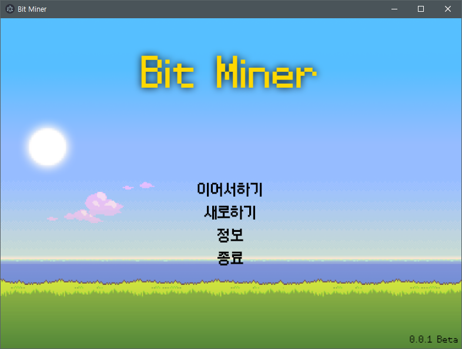
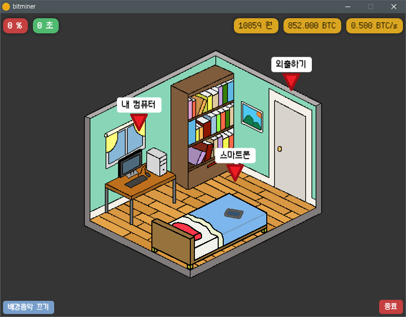
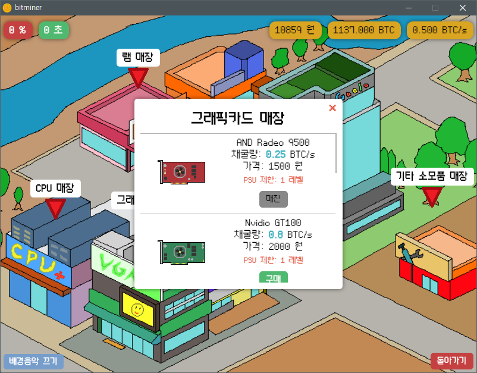

<div align="center">

  

  [](https://github.com/standard/standard)
  
</div>

# BitMiner
<div align="center">

## 코인을 채굴하고, 장비를 업그레이드하고, 돈을 모아보세요! 

[게임 다운로드](https://github.com/leegeunhyeok/BitMiner/releases/latest)

</div>

<div align="center">

  

  

</div>

# 개발 설정
의존성 모듈들을 설치한 후 `dev` 스크립트 실행
```bash
npm i # npm install
npm run dev
```

# 빌드
개발 후 `build` 스크립트 실행
```bash
npm run build
```

빌드 성공 시 build 폴더에 빌드 된 프로그램이 생성됩니다.

# 정보
- [Electron](https://electronjs.org/) 기반의 웹 게임
- 리소스 [출처](https://github.com/leegeunhyeok/BitMiner/blob/master/RESORCES.md)
- 개발자: 이근혁(lghlove0509@naver.com)